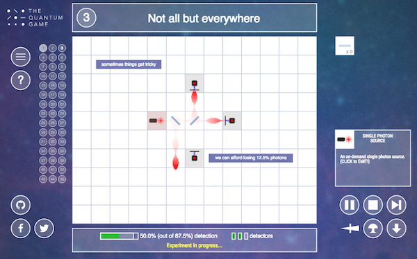

Quantum Game
============

Quantum Game - play with photons, superposition and entanglement. In your browser! With true quantum mechanics underneath!

* Official address: http://quantumgame.io (initial beta released on 3 Jun 2016, http://play.quantumgame.io)
* Social media: Facebook: [Quantum Game with Photons](https://www.facebook.com/quantumgameio), Twitter: [@quantumgameio](https://twitter.com/quantumgameio)
* Authors: [Piotr Migdał](http://p.migdal.pl), [Patryk Hes](https://github.com/pathes), [Michał Krupiński](http://www.fiztaszki.pl/user/3).
* Supported by: [eNgage III/2014](http://www.fnp.org.pl/laureaci-engage-iii-edycja/) grant.
* A recent screenshot:




# Development version

It's JavaScript, ES6. To build it you need [Node.JS](https://nodejs.org/) and [jspm.io](http://jspm.io/) package manager.


## Installing

After installing Node.js and jspm.io, and cloning this repository:

First, install global packages:
```bash
npm install --global karma-cli
```

Then install local packages.
```bash
npm install
jspm install
```

## Running server

Start local HTTP server in the quantum game directory (e.g. by [http-server](https://www.npmjs.com/package/http-server)).

## Running tests

```bash
karma start
```

# Production version

Bundle it (and minify, if you want):

```bash
jspm bundle-sfx --minify app
```

It creates a `build.js` file. To run it wee need a modified `index.html` (it is a *manually*-modified file, stored in `bundled/index.html`).

On the server, the structure of files should look as follows:

```bash
css\
favicon.ico
build.js
index.html
```
